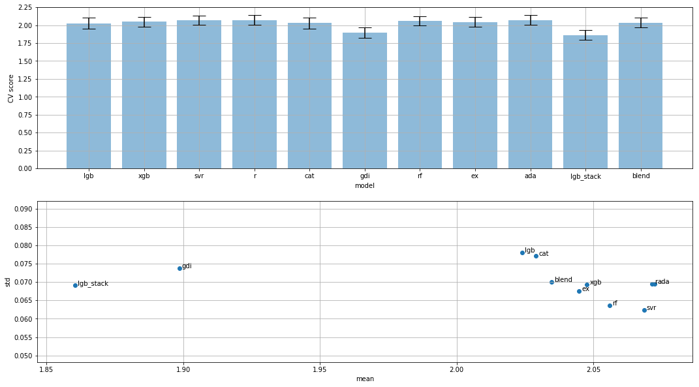

# LANL Earthquake Prediction from Kaggle

Repository for the SlimBros team for the [LANL Earthquake Prediction challenge](https://www.kaggle.com/c/LANL-Earthquake-Prediction/) from Kaggle (May2019 to June2019). In this competition, the goal is to predict when the earthquake will take place. Specifically, to predict the time remaining before laboratory earthquakes occur from real-time seismic data.

## Table of contents
  * [Team](#team)
  * [Timeline](#timeline)
  * [File structure](#file-structure) 
  * [Models](#models)
  * [Current status](#current-status) 
  * [Useful links](#useful-links)

## Team
- [Ricard Delgado-Gonzalo](https://www.linkedin.com/in/ricarddelgadogonzalo/)
- [Guillem Delgado](https://www.linkedin.com/in/guillem-delgado-gonzalo-576aa73a/)

## Timeline
- May 27, 2019 - Entry deadline. Must accept the competition rules before this date in order to compete.
- May 27, 2019 - Team Merger deadline. This is the last day participants may join or merge teams.
- May 27, 2019 - External Data Disclosure deadline. All external data used in the competition must be disclosed in the forums by this date.
- June 3, 2019 - Final submission deadline.

All deadlines are at 11:59 PM UTC on the corresponding day unless otherwise noted. The competition organizers reserve the right to update the contest timeline if they deem it necessary.

## File structure
```
.
|-- 1. Basic Feature Benchmark (v0).ipynb <- Initial tests
|-- 2. Seismic data EDA and baseline (v1).ipynb
|-- 3. Earthquakes FE - More features and samples (v1).ipynb
|-- 3. Earthquakes FE - More features and samples (v2).ipynb
|-- 3. Earthquakes FE - More features and samples (v3).ipynb
|-- 4. Test on new models.ipynb
|-- exploratory_data_analysis
|   |-- EDA.py
|   `-- utils.py
|-- features
|   |-- gen_predictor.py
|   `-- lanl_features.py
|-- feature_search_gdi_nn_5x256x1.py
|-- figures
|   |-- 5x256x1.png
|   |-- all_featuresx256x1.png
|   `-- model.png
|-- LANL Master notebook.ipynb
|-- LANL Sampling schemes.ipynb
|-- README.md
`-- utils
    |-- fancy_plots.py
    |-- frequency_estimation.py
    |-- parabolic.py
    `-- sampling.py
```

## Models
- [x] Classical ML
  - [x] LGBM
  - [x] XGBoost
  - [x] SVM
  - [x] Catboost
  - [x] Kernel ridge
  - [x] Modified genetic program model inspired in [this](https://www.kaggle.com/scirpus/andrews-script-plus-a-genetic-program-model)
  - [x] Random forest
  - [x] Extremely randomized trees
  - [x] Ada boost with a KernelRidge as base regressor
- [ ] Neural networks
  - [x] Fully-connected with (all_features)x256x1
  - [ ] Ensemble of fully connected with 5x256x1
  - [x] DNN
  - [ ] RNN
- [x] Blending the classical ML models
- [x] Stacking the classical ML models

## Ongoing tasks
- [ ] Data augmentation
  - [ ] Add Gaussian noise
  - [ ] Generate shifts
- [ ] Regenerate ensemble FC-NN model with tanh and all features
- [ ] Regenerate ensemble FC-NN model with relu and all features
- [ ] Evaluate robustness of each model

## Current status
Comparison of the different models.


## Useful links
- [Challenge website](https://www.kaggle.com/c/LANL-Earthquake-Prediction/)
- [Submit predictions](https://www.kaggle.com/c/LANL-Earthquake-Prediction/submit)
- [Leaderboard](https://www.kaggle.com/c/LANL-Earthquake-Prediction/leaderboard)